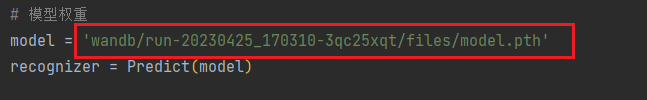

# B6智慧农业——深度学习模型

---
## 🔈Procedure
### 赛题简介：
该项目为[【【软件杯-B6智慧农业-植物表型特征识别】赛题-🔍】](https://www.cnsoftbei.com/plus/view.php?aid=826) 中的深度学习模型部分，
旨在实现三类植物叶片病害的分类，属于ImageClassification任务，本身任务难度为入门，部分难度中等。

### 实现目标：
深度学习模型部分主要目标是训练出一个性能、泛化能力较好的模型，再与后端对接，使其该模型能被java调用且预测的输出结果与python一致，旨在完成该任务。

### 开发大纲：
深度学习模型的开发主要分为以下：

1、数据预处理（包括数据集的下载、分析、划分、数据增强等）

2、模型搭建（包括神经网络结构搭建、添加各种tricks等）

3、模型训练（包括训练模型、可视化训练过程、调参优化）

4、模型预测（包括单张、批量图片的预测（提前提取的测试集））

5、模型部署（包括pth模型转onnx模型，使其能够被后端java调用）

---
## 👷Structure
项目根目录下的各个文件夹及文件的说明：
```
-LeafDiseaseCls/       根目录
    -&temp/           临时文件夹
    -dataset/         数据集文件夹（提前划分好的训练、验证、测试集）
        -test/          测试集
        -train/         训练集
        -val/           验证集
    -downloads/         爬虫保存图片网图）
    -predict_demo/      预测demo（torch、onnx模型的预测）
    -wandb/              wandb可视化相关（含训练保存的模型权重文件）
    -downloadimg.py     爬取百度图库图片脚本
    -get_testimg.py     提取测试集脚本（预处理）
    -load_data.py       加载数据集脚本
    -model.onnx          onnx权重文件
    -model.2222.onnx    
    -modek-nor-0.5.onnx 
    -mogai_transflorm_resize.py     魔改transfroms中的resize函数 
    -net.py         神经网路结构
    -normilize.py       求自定义数据集的mean、std
    -predict.py      预测脚本
    -README.md
    -requirement.txt        依赖库
    -show_dataset.py        可视化数据集脚本
    -split_train_val.py     划分训练集、验证集（预处理）
    -summary_dataset.py     打印数据集信息
    -torch2onnx.py          torch转onnx
    -train.py              训练脚本     
```

---
## 🐕How to Run
### 1、环境配置
```bash
# 创建虚拟环境
conda create -n myenv python=3.7
```
```bash
# 激活虚拟环境
conda activate myenv
```
```bash
# 下载依赖库
pip install -r requirements.txt
```

### 2、Training
1）需要注册[wandb-🔍](https://wandb.ai/) ，修改wandb初始化信息，将下面部分改为你自己的信息：


2）执行训练脚本：
```bash
python train.py
```

### 3、Predict
1）修改模型权重文件的路径：

2）选择单张或批量预测，自行注释相关部分即可；
3）执行预测脚本：
```bash
python predict.py
```

---
若有问题，联系技术支持[2933582448@qq.com]()


